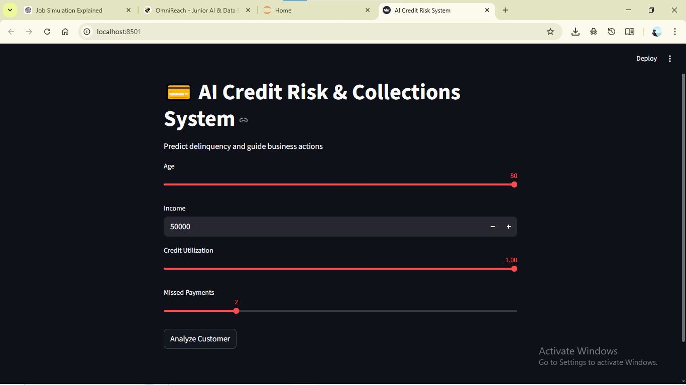
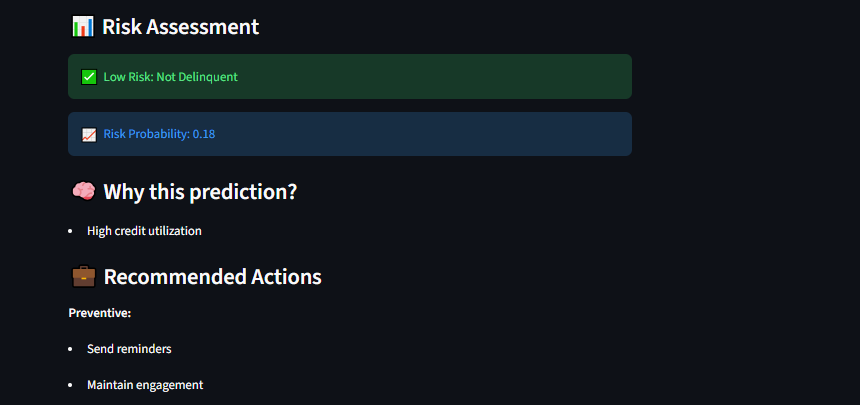

# 💳 AI Credit Risk & Collections Decision System

## 📌 Overview
This project builds an end-to-end machine learning system to predict customer delinquency and support collections strategy using AI.

## 🚀 Features
- Predicts delinquency risk using ML
- Real-time risk scoring via Streamlit app
- Business recommendations for collections team
- Explainable decision logic
- Responsible AI considerations

## 🧠 Model
- Algorithm: Random Forest (balanced)
- Handles class imbalance
- Uses financial behavior features:
  - Credit Utilization
  - Missed Payments
  - Income
  - Age

## 📊 Workflow
1. Data Cleaning & Preprocessing  
2. Feature Engineering  
3. Model Training  
4. Prediction System  
5. Streamlit Deployment  

## 💼 Business Impact
- Identifies high-risk customers early  
- Improves collections efficiency  
- Supports proactive intervention strategies  

## ⚖️ Responsible AI
- Bias-aware modeling  
- Explainable predictions  
- Human-in-the-loop decision support  

## 🖥️ Run Locally

```bash
pip install -r requirements.txt
python src/train.py
streamlit run app/app.py

## 📸 App Preview

### 🔹 Input Interface


### 🔹 Risk Assessment Output

